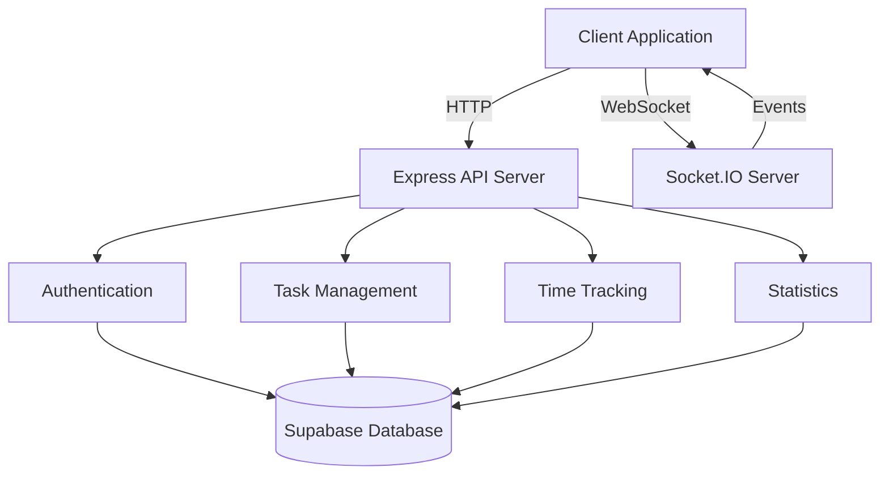
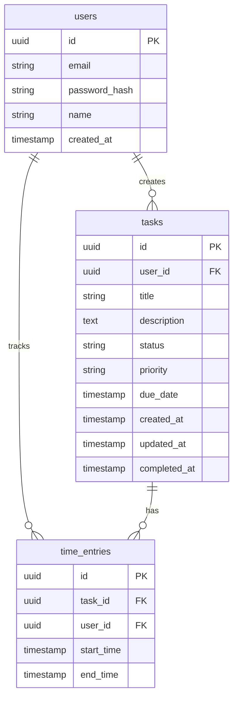
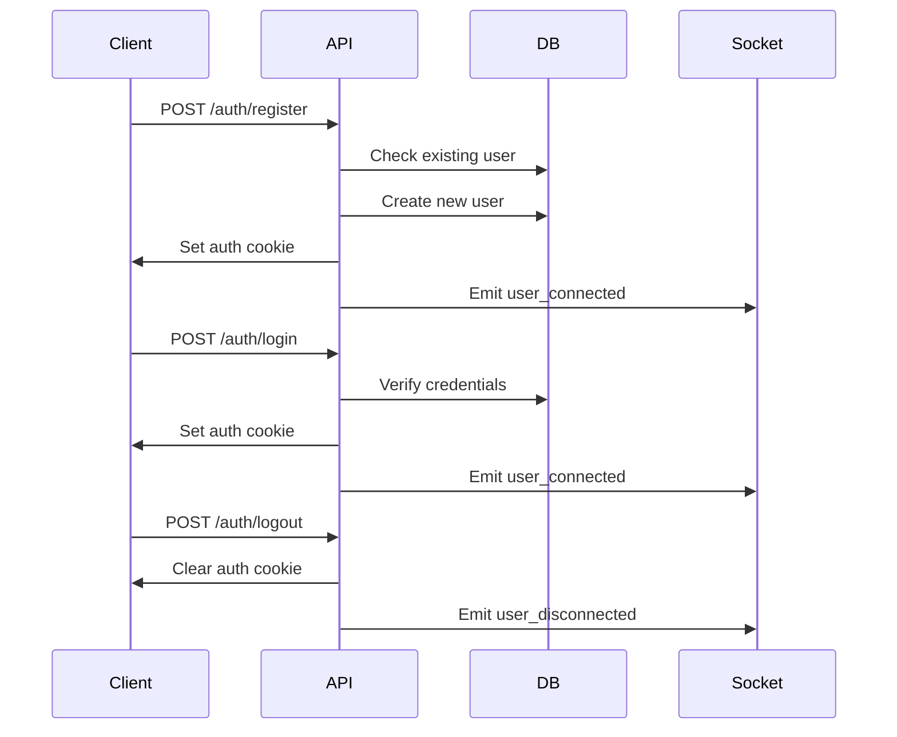
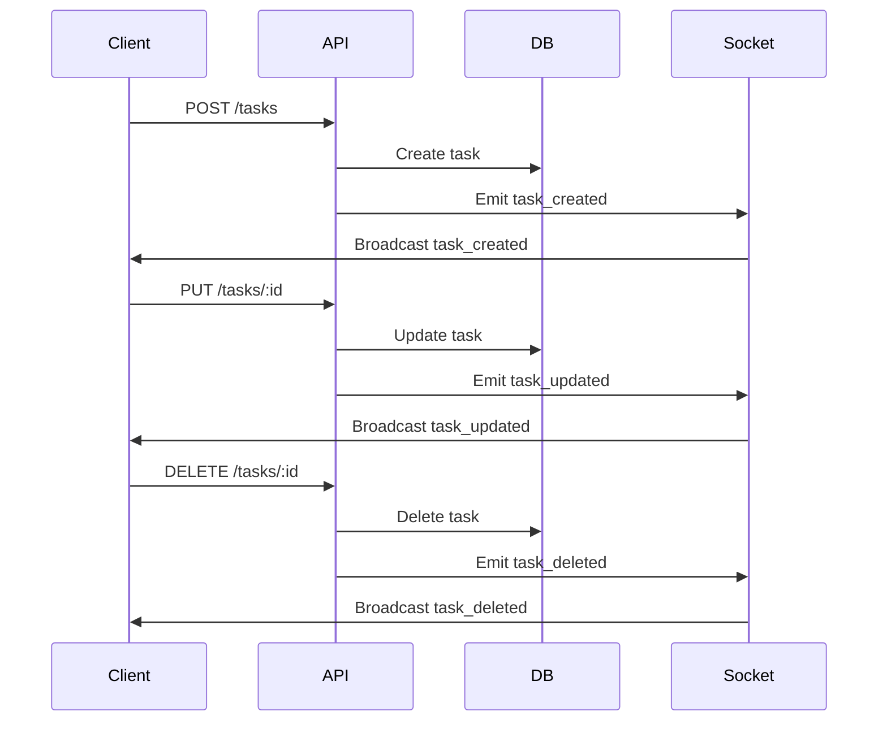
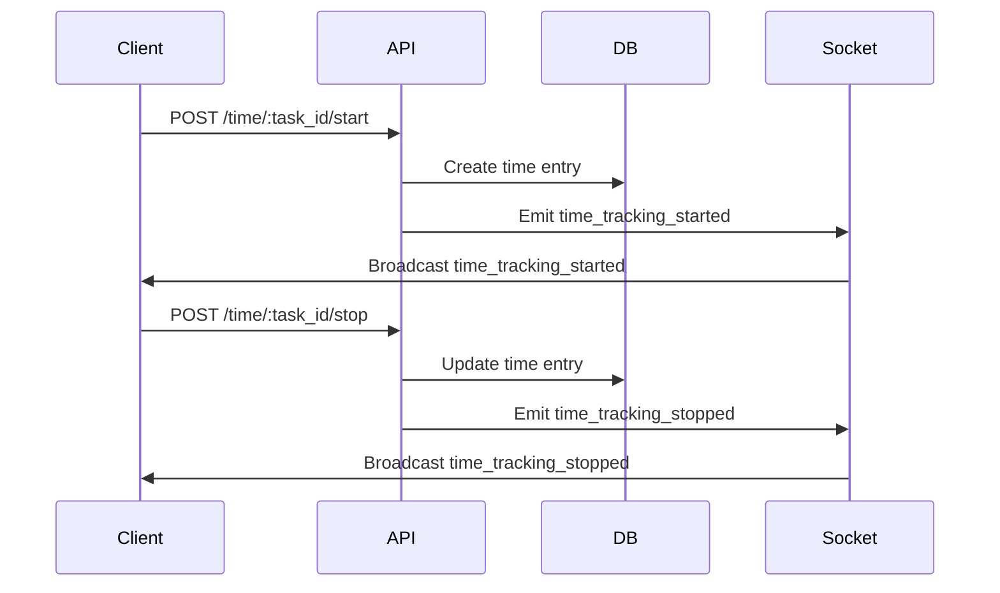

# Task Management System Backend

A robust backend system for task management with real-time updates, time tracking, and productivity analytics.

## System Architecture



## Database Schema



## Authentication Flow



## Task Management Flow



## Time Tracking Flow



## Features

### Authentication
- JWT-based authentication
- HTTP-only cookies for token storage
- Secure password hashing with bcrypt
- User registration and login
- Session management

### Task Management
- CRUD operations for tasks
- Task status updates
- Priority management
- Due date handling
- Task filtering and sorting

### Time Tracking
- Start/stop time tracking
- Time entry management
- Time reports and analytics
- Task-specific time tracking

### Statistics
- Task completion rates
- Time spent per task
- Productivity metrics
- Time distribution by priority
- Completion streaks

### Real-time Updates
- WebSocket connections
- Event-based updates
- Real-time task updates
- Time tracking notifications
- Statistics updates

## API Endpoints

### Authentication
- `POST /auth/register`: Register new user
- `POST /auth/login`: User login
- `POST /auth/logout`: User logout

### Tasks
- `GET /tasks`: Get all tasks
- `POST /tasks`: Create new task
- `GET /tasks/:id`: Get task by ID
- `PUT /tasks/:id`: Update task
- `DELETE /tasks/:id`: Delete task
- `PATCH /tasks/:id/status`: Update task status

### Time Tracking
- `POST /time/:task_id/start`: Start time tracking
- `POST /time/:task_id/stop`: Stop time tracking
- `GET /time/:task_id/entries`: Get time entries
- `GET /time/report`: Get time report

### Statistics
- `GET /statistics/tasks`: Get task statistics
- `GET /statistics/time`: Get time statistics
- `GET /statistics/productivity`: Get productivity metrics

## Security Features

1. **Authentication**:
   - JWT-based authentication
   - HTTP-only cookies for token storage
   - Secure password hashing with bcrypt

2. **Authorization**:
   - Middleware to verify user authentication
   - Row-level security in Supabase
   - User-specific data access

3. **Data Protection**:
   - Input validation
   - SQL injection prevention
   - XSS protection

## Error Handling

The system uses a centralized error handling approach:
- Custom error classes for different error types
- Consistent error response format
- Detailed error logging
- Client-friendly error messages

## Performance Considerations

1. **Database**:
   - Indexed queries
   - Efficient joins
   - Pagination for large datasets

2. **Caching**:
   - Statistics caching
   - Task list caching
   - Time entry caching

3. **Real-time Updates**:
   - Efficient event broadcasting
   - Connection pooling
   - Event debouncing

## Setup and Installation

1. Install dependencies:
```bash
pnpm install
```

2. Set up environment variables:
```bash
cp .env.example .env
```

3. Configure the following environment variables:
```bash
PORT=3000
NODE_ENV=development
JWT_SECRET=your_jwt_secret
SUPABASE_URL=your_supabase_url
SUPABASE_KEY=your_supabase_key
```

4. Start the development server:
```bash
pnpm dev
```

## Development

- `pnpm dev`: Start development server with hot reload
- `pnpm build`: Build for production
- `pnpm start`: Start production server
- `pnpm lint`: Run linter
- `pnpm test`: Run tests

## Technologies Used

- Node.js
- Express.js
- TypeScript
- Socket.IO
- Supabase
- JWT
- bcrypt
- Winston (logging)
- Jest (testing)

## Contributing

1. Fork the repository
2. Create your feature branch
3. Commit your changes
4. Push to the branch
5. Create a new Pull Request

## License

This project is licensed under the MIT License. 